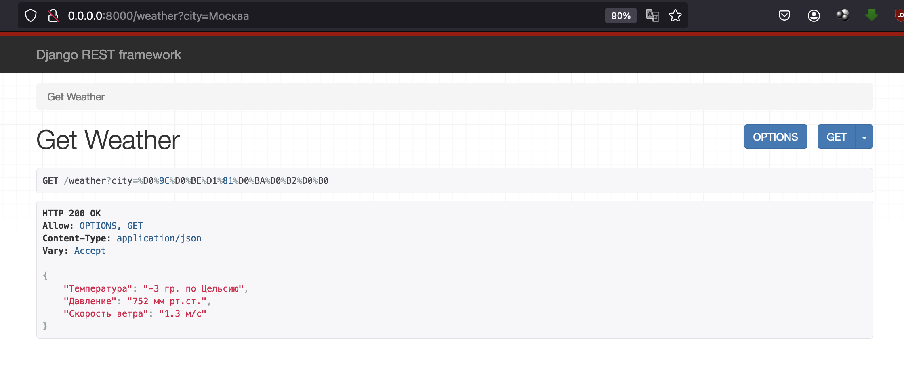
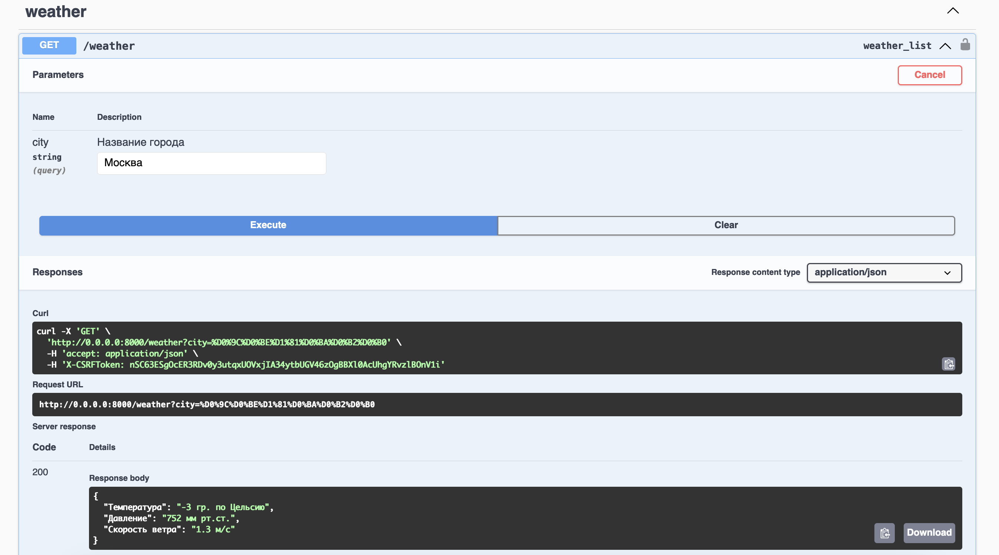
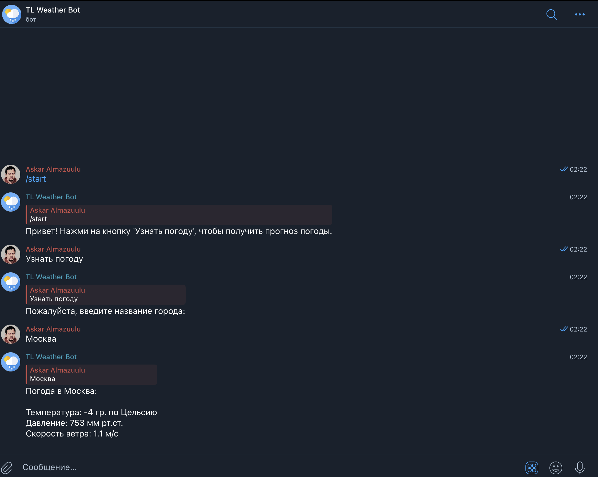

# Weather API Project

## Описание проекта
Этот проект представляет собой простое REST API, разработанное с использованием Django Rest Framework. Оно позволяет пользователям получать информацию о погоде для указанного города. Поскольку для запроса погодных данных необходимы координаты города (широта и долгота), проект также использует Геокодер для получения этих координат на основе названия города.

## Функциональность
- Получение текущей погоды для выбранного города, используя его название.
- Использование Геокодера для определения координат города (широты и долготы).
- Кэширование данных о погоде и координатах на 30 минут для уменьшения количества запросов к внешним API.

## Технологии
- Django & Django Rest Framework
- SQLite для хранения данных
- Docker для упрощения развертывания проекта
- Внешние API, включая Геокодер и Yandex Weather API

## Установка и запуск

### Предварительные требования
- Установленный Docker
- Установленный Docker Compose

### Шаги для запуска
1. Клонируйте репозиторий на ваш локальный компьютер:
    ```
    git clone https://github.com/almazuulu/task_tlcompany.git
    cd task_tlcompany
    ```
2. Создайте файл `.env` в корне проекта и добавьте в него необходимые переменные окружения:
    ```
    GEOCODE_API_KEY=ваш_geocode_api_key
    WEATHER_API_KEY=ваш_weather_api_key
    ```

3. Перейдите в папку `docker`:
    ```
    cd docker
    ```

4. Запустите проект с помощью Docker Compose:
    ```
    docker-compose up
    ```

5. После запуска сервера, API будет доступен по адресу `http://localhost:8000/`.

## Использование API

Для получения информации о погоде отправьте GET-запрос на `/weather?city=Название_Города`. 
Например:
`http://0.0.0.0:8000/weather?city=Москва`

Также вы можете запустить через swagger. Для этого перейдите по адресу `http://0.0.0.0:8000/swagger` 
далее нажмите на нужный API метод, после чего вам необходимо будет указать имя города, 
для которого вы собираетесь узнать погоду в поле "city" и нажмите на "Execute", 
в результате вы получите нужную погоду

6. Скриншоты




## Телеграм Бот

### Описание Телеграм Бота
Телеграм-бот в этом проекте позволяет пользователям получать текущую погоду для указанного города. После ввода названия города бот отправляет запрос к серверу Django для получения данных о погоде и выводит их в чат.

### Получение Токена Бота
Для работы телеграм-бота необходимо получить API-токен от BotFather в Telegram:
1. Откройте Telegram и найдите @BotFather.
2. Отправьте команду `/newbot` и следуйте инструкциям для создания нового бота.
3. По завершении BotFather предоставит вам токен. Сохраните его, он будет использоваться в файле конфигурации бота.

### Запуск Телеграм Бота
Телеграм-бот запускается вместе с Django-приложением с использованием Docker. Просто следуйте инструкциям запуска проекта выше, и бот будет запущен автоматически.

4. Пример телеграм бота `https://t.me/tl_weather_bot`
   и Скриншот:
   
  